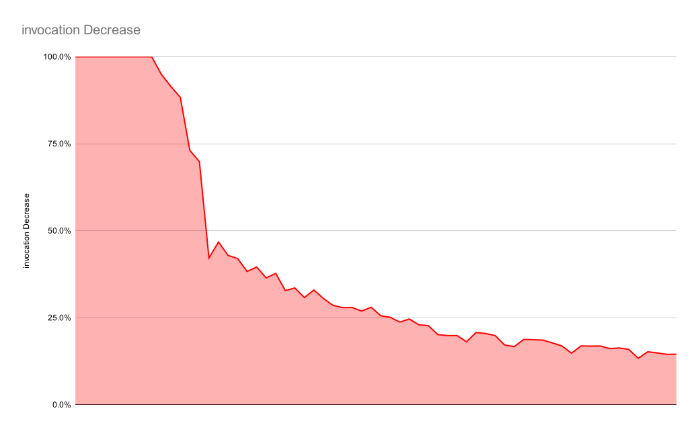

# Compare add by struct size

There's some weird thing I noticed
Basically, adding a `struct` with four fields is faster than that of five.

> "are you stupid? four is smaller than five!"

Well yes, but noooooo, the difference is terribly high

## Just to compare 4 vs 5 vs 6 vs 7 vs 8:

I run them with below instruction:

```sh
go test -benchmem -run=^$ -bench ^BenchmarkAdd addcompare
```

### testType: `int`

```
BenchmarkAdd1-16        1000000000               1.000 ns/op           0 B/op          0 allocs/op
BenchmarkAdd2-16        1000000000               1.000 ns/op           0 B/op          0 allocs/op
BenchmarkAdd3-16        1000000000               1.000 ns/op           0 B/op          0 allocs/op
BenchmarkAdd4-16        1000000000               1.000 ns/op           0 B/op          0 allocs/op
BenchmarkAdd5-16        363351945                3.330 ns/op           0 B/op          0 allocs/op
BenchmarkAdd6-16        284908172                4.161 ns/op           0 B/op          0 allocs/op
BenchmarkAdd7-16        285791798                4.220 ns/op           0 B/op          0 allocs/op
BenchmarkAdd8-16        228743704                5.184 ns/op           0 B/op          0 allocs/op
PASS
ok      addcompare      8.793s
```

### testType: `int32`

```
BenchmarkAdd1-16        1000000000               1.000 ns/op           0 B/op          0 allocs/op
BenchmarkAdd2-16        1000000000               1.000 ns/op           0 B/op          0 allocs/op
BenchmarkAdd3-16        1000000000               1.000 ns/op           0 B/op          0 allocs/op
BenchmarkAdd4-16        1000000000               1.000 ns/op           0 B/op          0 allocs/op
BenchmarkAdd5-16        374084659                3.203 ns/op           0 B/op          0 allocs/op
BenchmarkAdd6-16        287177059                4.102 ns/op           0 B/op          0 allocs/op
BenchmarkAdd7-16        284113792                4.187 ns/op           0 B/op          0 allocs/op
BenchmarkAdd8-16        227083088                5.299 ns/op           0 B/op          0 allocs/op
PASS
ok      addcompare      8.775s
```

### testType `float64`

```
BenchmarkAdd1-16        1000000000               1.000 ns/op           0 B/op          0 allocs/op
BenchmarkAdd2-16        1000000000               1.000 ns/op           0 B/op          0 allocs/op
BenchmarkAdd3-16        1000000000               1.000 ns/op           0 B/op          0 allocs/op
BenchmarkAdd4-16        1000000000               1.000 ns/op           0 B/op          0 allocs/op
BenchmarkAdd5-16        366349935                3.272 ns/op           0 B/op          0 allocs/op
BenchmarkAdd6-16        285188324                4.150 ns/op           0 B/op          0 allocs/op
BenchmarkAdd7-16        282062736                4.252 ns/op           0 B/op          0 allocs/op
BenchmarkAdd8-16        229625409                5.207 ns/op           0 B/op          0 allocs/op
PASS
ok      addcompare      8.783s
```

### testType: `byte`

```
BenchmarkAdd1-16        1000000000               1.000 ns/op           0 B/op          0 allocs/op
BenchmarkAdd2-16        1000000000               1.000 ns/op           0 B/op          0 allocs/op
BenchmarkAdd3-16        1000000000               1.000 ns/op           0 B/op          0 allocs/op
BenchmarkAdd4-16        1000000000               1.000 ns/op           0 B/op          0 allocs/op
BenchmarkAdd5-16        380861066                3.192 ns/op           0 B/op          0 allocs/op
BenchmarkAdd6-16        284786684                4.089 ns/op           0 B/op          0 allocs/op
BenchmarkAdd7-16        280509824                4.212 ns/op           0 B/op          0 allocs/op
BenchmarkAdd8-16        232922336                5.175 ns/op           0 B/op          0 allocs/op
PASS
ok      addcompare      8.773s
```

---

## Summary

Yea, it's weird

| Fields | `int` (ns/op) | `int32` (ns/op) | `float64` (ns/op) | `byte` (ns/op) |
| ------ | ------------- | --------------- | ----------------- | -------------- |
| 1      | 1.000         | 1.000           | 1.000             | 1.000          |
| 2      | 1.000         | 1.000           | 1.000             | 1.000          |
| 3      | 1.000         | 1.000           | 1.000             | 1.000          |
| 4      | 1.000         | 1.000           | 1.000             | 1.000          |
| 5      | 3.450         | 3.287           | 3.383             | 3.224          |
| 6      | 3.692         | 4.233           | 4.063             | 4.121          |
| 7      | 4.496         | 4.395           | 4.198             | 4.190          |
| 8      | 5.953         | 5.313           | 5.208             | 5.237          |

---

# But why?

So, i decided to peek into the assembly
I had to compile the tests, since I didn't make it a main package

I compiled it using command:

```sh
go test -c -gcflags="all=-S -N -l" . > "$(basename $(pwd)).asm" 2>&1
```

so, some finding:

`Add4` looks like this in the assembly:

```asm
addcompare.Add4[addcompare.testType] STEXT dupok size=405 args=0x40 locals=0x90 funcid=0x17 align=0x0
	0x0000 00000 (/app/add.go:68)	TEXT	addcompare.Add4[addcompare.testType](SB), DUPOK|WRAPPER|ABIInternal, $144-64
	app/add.go
	0x0005 00005 (/app/add.go:68)	CMPQ	R12, 16(R14)
	0x0009 00009 (/app/add.go:68)	PCDATA	$0, $-2
	0x0009 00009 (/app/add.go:68)	JLS	269
	0x000f 00015 (/app/add.go:68)	PCDATA	$0, $-1
	0x000f 00015 (/app/add.go:68)	PUSHQ	BP
	0x0010 00016 (/app/add.go:68)	MOVQ	SP, BP
	0x0013 00019 (/app/add.go:68)	SUBQ	$136, SP
	0x001a 00026 (/app/add.go:68)	MOVQ	32(R14), R12
	0x001e 00030 (/app/add.go:68)	NOP
	0x0020 00032 (/app/add.go:68)	TESTQ	R12, R12
	0x0023 00035 (/app/add.go:68)	JNE	378
	0x0029 00041 (/app/add.go:68)	NOP
	0x0029 00041 (/app/add.go:68)	FUNCDATA	$0, gclocals·g5+hNtRBP6YXNjfog7aZjQ==(SB)
	0x0029 00041 (/app/add.go:68)	FUNCDATA	$1, gclocals·g5+hNtRBP6YXNjfog7aZjQ==(SB)
	0x0029 00041 (/app/add.go:68)	FUNCDATA	$5, addcompare.Add4[addcompare.testType].arginfo1(SB)
	0x0029 00041 (/app/add.go:68)	MOVSD	X0, addcompare.x+152(SP)
	0x0032 00050 (/app/add.go:68)	MOVSD	X1, addcompare.x+160(SP)
	0x003b 00059 (/app/add.go:68)	MOVSD	X2, addcompare.x+168(SP)
	0x0044 00068 (/app/add.go:68)	MOVSD	X3, addcompare.x+176(SP)
	0x004d 00077 (/app/add.go:68)	MOVSD	X4, addcompare.y+184(SP)
	0x0056 00086 (/app/add.go:68)	MOVSD	X5, addcompare.y+192(SP)
	0x005f 00095 (/app/add.go:68)	MOVSD	X6, addcompare.y+200(SP)
	0x0068 00104 (/app/add.go:68)	MOVSD	X7, addcompare.y+208(SP)
	0x0071 00113 (/app/add.go:68)	MOVUPS	X15, addcompare.z+72(SP)
	0x0077 00119 (/app/add.go:68)	MOVUPS	X15, addcompare.z+88(SP)
	0x007d 00125 (/app/add.go:68)	MOVSD	addcompare.x+152(SP), X0
	0x0086 00134 (/app/add.go:68)	MOVSD	addcompare.y+184(SP), X4
	0x008f 00143 (/app/add.go:68)	MOVSD	addcompare.x+160(SP), X1
	0x0098 00152 (/app/add.go:68)	MOVSD	addcompare.y+192(SP), X5
	0x00a1 00161 (/app/add.go:68)	MOVSD	addcompare.x+168(SP), X2
	0x00aa 00170 (/app/add.go:68)	MOVSD	addcompare.y+200(SP), X6
	0x00b3 00179 (/app/add.go:68)	MOVSD	addcompare.x+176(SP), X3
	0x00bc 00188 (/app/add.go:68)	MOVSD	addcompare.y+208(SP), X7
	0x00c5 00197 (/app/add.go:68)	LEAQ	addcompare..dict.Add4[addcompare.testType](SB), AX
	0x00cc 00204 (/app/add.go:68)	PCDATA	$1, $0
	0x00cc 00204 (/app/add.go:68)	CALL	addcompare.Add4[go.shape.int32](SB)
	0x00d1 00209 (/app/add.go:68)	MOVSD	X0, addcompare..autotmp_3+104(SP)
	0x00d7 00215 (/app/add.go:68)	MOVSD	X1, addcompare..autotmp_3+112(SP)
	0x00dd 00221 (/app/add.go:68)	MOVSD	X2, addcompare..autotmp_3+120(SP)
	0x00e3 00227 (/app/add.go:68)	MOVSD	X3, addcompare..autotmp_3+128(SP)
	0x00ec 00236 (/app/add.go:68)	MOVSD	X0, addcompare.z+72(SP)
	0x00f2 00242 (/app/add.go:68)	MOVSD	X1, addcompare.z+80(SP)
	0x00f8 00248 (/app/add.go:68)	MOVSD	X2, addcompare.z+88(SP)
	0x00fe 00254 (/app/add.go:68)	MOVSD	X3, addcompare.z+96(SP)
	0x0104 00260 (/app/add.go:68)	ADDQ	$136, SP
	0x010b 00267 (/app/add.go:68)	POPQ	BP
	0x010c 00268 (/app/add.go:68)	RET
	0x010d 00269 (/app/add.go:68)	NOP
	0x010d 00269 (/app/add.go:68)	PCDATA	$1, $-1
	0x010d 00269 (/app/add.go:68)	PCDATA	$0, $-2
	0x010d 00269 (/app/add.go:68)	MOVSD	X0, 8(SP)
	0x0113 00275 (/app/add.go:68)	MOVSD	X1, 16(SP)
	0x0119 00281 (/app/add.go:68)	MOVSD	X2, 24(SP)
	0x011f 00287 (/app/add.go:68)	MOVSD	X3, 32(SP)
	0x0125 00293 (/app/add.go:68)	MOVSD	X4, 40(SP)
	0x012b 00299 (/app/add.go:68)	MOVSD	X5, 48(SP)
	0x0131 00305 (/app/add.go:68)	MOVSD	X6, 56(SP)
	0x0137 00311 (/app/add.go:68)	MOVSD	X7, 64(SP)
	0x013d 00317 (/app/add.go:68)	NOP
	0x0140 00320 (/app/add.go:68)	CALL	runtime.morestack_noctxt(SB)
	0x0145 00325 (/app/add.go:68)	PCDATA	$0, $-1
	0x0145 00325 (/app/add.go:68)	MOVSD	8(SP), X0
	0x014b 00331 (/app/add.go:68)	MOVSD	16(SP), X1
	0x0151 00337 (/app/add.go:68)	MOVSD	24(SP), X2
	0x0157 00343 (/app/add.go:68)	MOVSD	32(SP), X3
	0x015d 00349 (/app/add.go:68)	MOVSD	40(SP), X4
	0x0163 00355 (/app/add.go:68)	MOVSD	48(SP), X5
	0x0169 00361 (/app/add.go:68)	MOVSD	56(SP), X6
	0x016f 00367 (/app/add.go:68)	MOVSD	64(SP), X7
	0x0175 00373 (/app/add.go:68)	JMP	0
	0x017a 00378 (/app/add.go:68)	LEAQ	152(SP), R13
	0x0182 00386 (/app/add.go:68)	CMPQ	(R12), R13
	0x0186 00390 (/app/add.go:68)	JNE	41
	0x018c 00396 (/app/add.go:68)	MOVQ	SP, (R12)
	0x0190 00400 (/app/add.go:68)	JMP	41
```

and `Add5` looks like this in the assembly:

```asm
addcompare.Add5[addcompare.testType] STEXT dupok size=595 args=0x50 locals=0xd8 funcid=0x17 align=0x0
	0x0000 00000 (/app/add.go:77)	TEXT	addcompare.Add5[addcompare.testType](SB), DUPOK|WRAPPER|ABIInternal, $216-80
	0x0000 00000 (/app/add.go:77)	LEAQ	-88(SP), R12
	0x0005 00005 (/app/add.go:77)	CMPQ	R12, 16(R14)
	0x0009 00009 (/app/add.go:77)	PCDATA	$0, $-2
	0x0009 00009 (/app/add.go:77)	JLS	434
	0x000f 00015 (/app/add.go:77)	PCDATA	$0, $-1
	0x000f 00015 (/app/add.go:77)	PUSHQ	BP
	0x0010 00016 (/app/add.go:77)	MOVQ	SP, BP
	0x0013 00019 (/app/add.go:77)	SUBQ	$208, SP
	0x001a 00026 (/app/add.go:77)	MOVQ	32(R14), R12
	0x001e 00030 (/app/add.go:77)	NOP
	0x0020 00032 (/app/add.go:77)	TESTQ	R12, R12
	0x0023 00035 (/app/add.go:77)	JNE	568
	0x0029 00041 (/app/add.go:77)	NOP
	0x0029 00041 (/app/add.go:77)	FUNCDATA	$0, gclocals·g5+hNtRBP6YXNjfog7aZjQ==(SB)
	0x0029 00041 (/app/add.go:77)	FUNCDATA	$1, gclocals·g5+hNtRBP6YXNjfog7aZjQ==(SB)
	0x0029 00041 (/app/add.go:77)	FUNCDATA	$5, addcompare.Add5[addcompare.testType].arginfo1(SB)
	0x0029 00041 (/app/add.go:77)	MOVSD	X0, addcompare.x+224(SP)
	0x0032 00050 (/app/add.go:77)	MOVSD	X1, addcompare.x+232(SP)
	0x003b 00059 (/app/add.go:77)	MOVSD	X2, addcompare.x+240(SP)
	0x0044 00068 (/app/add.go:77)	MOVSD	X3, addcompare.x+248(SP)
	0x004d 00077 (/app/add.go:77)	MOVSD	X4, addcompare.x+256(SP)
	0x0056 00086 (/app/add.go:77)	MOVSD	X5, addcompare.y+264(SP)
	0x005f 00095 (/app/add.go:77)	MOVSD	X6, addcompare.y+272(SP)
	0x0068 00104 (/app/add.go:77)	MOVSD	X7, addcompare.y+280(SP)
	0x0071 00113 (/app/add.go:77)	MOVSD	X8, addcompare.y+288(SP)
	0x007b 00123 (/app/add.go:77)	MOVSD	X9, addcompare.y+296(SP)
	0x0085 00133 (/app/add.go:77)	MOVUPS	X15, addcompare.z+88(SP)
	0x008b 00139 (/app/add.go:77)	MOVUPS	X15, addcompare.z+96(SP)
	0x0091 00145 (/app/add.go:77)	MOVUPS	X15, addcompare.z+112(SP)
	0x0097 00151 (/app/add.go:77)	MOVSD	addcompare.x+224(SP), X0
	0x00a0 00160 (/app/add.go:77)	MOVSD	addcompare.y+264(SP), X5
	0x00a9 00169 (/app/add.go:77)	MOVSD	addcompare.x+232(SP), X1
	0x00b2 00178 (/app/add.go:77)	MOVSD	addcompare.y+272(SP), X6
	0x00bb 00187 (/app/add.go:77)	MOVSD	addcompare.x+240(SP), X2
	0x00c4 00196 (/app/add.go:77)	MOVSD	addcompare.y+280(SP), X7
	0x00cd 00205 (/app/add.go:77)	MOVSD	addcompare.x+248(SP), X3
	0x00d6 00214 (/app/add.go:77)	MOVSD	addcompare.y+288(SP), X8
	0x00e0 00224 (/app/add.go:77)	MOVSD	addcompare.x+256(SP), X4
	0x00e9 00233 (/app/add.go:77)	MOVSD	addcompare.y+296(SP), X9
	0x00f3 00243 (/app/add.go:77)	LEAQ	addcompare..dict.Add5[addcompare.testType](SB), AX
	0x00fa 00250 (/app/add.go:77)	PCDATA	$1, $0
	0x00fa 00250 (/app/add.go:77)	CALL	addcompare.Add5[go.shape.int32](SB)
	0x00ff 00255 (/app/add.go:77)	MOVSD	X0, addcompare..autotmp_4+128(SP)
	0x0108 00264 (/app/add.go:77)	MOVSD	X1, addcompare..autotmp_4+136(SP)
	0x0111 00273 (/app/add.go:77)	MOVSD	X2, addcompare..autotmp_4+144(SP)
	0x011a 00282 (/app/add.go:77)	MOVSD	X3, addcompare..autotmp_4+152(SP)
	0x0123 00291 (/app/add.go:77)	MOVSD	X4, addcompare..autotmp_4+160(SP)
	0x012c 00300 (/app/add.go:77)	MOVQ	addcompare..autotmp_4+128(SP), CX
	0x0134 00308 (/app/add.go:77)	MOVQ	CX, addcompare..autotmp_3+168(SP)
	0x013c 00316 (/app/add.go:77)	MOVUPS	addcompare..autotmp_4+136(SP), X10
	0x0145 00325 (/app/add.go:77)	MOVUPS	X10, addcompare..autotmp_3+176(SP)
	0x014e 00334 (/app/add.go:77)	MOVUPS	addcompare..autotmp_4+152(SP), X10
	0x0157 00343 (/app/add.go:77)	MOVUPS	X10, addcompare..autotmp_3+192(SP)
	0x0160 00352 (/app/add.go:77)	MOVQ	addcompare..autotmp_3+168(SP), CX
	0x0168 00360 (/app/add.go:77)	MOVQ	CX, addcompare.z+88(SP)
	0x016d 00365 (/app/add.go:77)	MOVUPS	addcompare..autotmp_3+176(SP), X10
	0x0176 00374 (/app/add.go:77)	MOVUPS	X10, addcompare.z+96(SP)
	0x017c 00380 (/app/add.go:77)	MOVUPS	addcompare..autotmp_3+192(SP), X10
	0x0185 00389 (/app/add.go:77)	MOVUPS	X10, addcompare.z+112(SP)
	0x018b 00395 (/app/add.go:77)	MOVSD	addcompare.z+88(SP), X0
	0x0191 00401 (/app/add.go:77)	MOVSD	addcompare.z+96(SP), X1
	0x0197 00407 (/app/add.go:77)	MOVSD	addcompare.z+104(SP), X2
	0x019d 00413 (/app/add.go:77)	MOVSD	addcompare.z+112(SP), X3
	0x01a3 00419 (/app/add.go:77)	MOVSD	addcompare.z+120(SP), X4
	0x01a9 00425 (/app/add.go:77)	ADDQ	$208, SP
	0x01b0 00432 (/app/add.go:77)	POPQ	BP
	0x01b1 00433 (/app/add.go:77)	RET
	0x01b2 00434 (/app/add.go:77)	NOP
	0x01b2 00434 (/app/add.go:77)	PCDATA	$1, $-1
	0x01b2 00434 (/app/add.go:77)	PCDATA	$0, $-2
	0x01b2 00434 (/app/add.go:77)	MOVSD	X0, 8(SP)
	0x01b8 00440 (/app/add.go:77)	MOVSD	X1, 16(SP)
	0x01be 00446 (/app/add.go:77)	MOVSD	X2, 24(SP)
	0x01c4 00452 (/app/add.go:77)	MOVSD	X3, 32(SP)
	0x01ca 00458 (/app/add.go:77)	MOVSD	X4, 40(SP)
	0x01d0 00464 (/app/add.go:77)	MOVSD	X5, 48(SP)
	0x01d6 00470 (/app/add.go:77)	MOVSD	X6, 56(SP)
	0x01dc 00476 (/app/add.go:77)	MOVSD	X7, 64(SP)
	0x01e2 00482 (/app/add.go:77)	MOVSD	X8, 72(SP)
	0x01e9 00489 (/app/add.go:77)	MOVSD	X9, 80(SP)
	0x01f0 00496 (/app/add.go:77)	CALL	runtime.morestack_noctxt(SB)
	0x01f5 00501 (/app/add.go:77)	PCDATA	$0, $-1
	0x01f5 00501 (/app/add.go:77)	MOVSD	8(SP), X0
	0x01fb 00507 (/app/add.go:77)	MOVSD	16(SP), X1
	0x0201 00513 (/app/add.go:77)	MOVSD	24(SP), X2
	0x0207 00519 (/app/add.go:77)	MOVSD	32(SP), X3
	0x020d 00525 (/app/add.go:77)	MOVSD	40(SP), X4
	0x0213 00531 (/app/add.go:77)	MOVSD	48(SP), X5
	0x0219 00537 (/app/add.go:77)	MOVSD	56(SP), X6
	0x021f 00543 (/app/add.go:77)	MOVSD	64(SP), X7
	0x0225 00549 (/app/add.go:77)	MOVSD	72(SP), X8
	0x022c 00556 (/app/add.go:77)	MOVSD	80(SP), X9
	0x0233 00563 (/app/add.go:77)	JMP	0
	0x0238 00568 (/app/add.go:77)	LEAQ	224(SP), R13
	0x0240 00576 (/app/add.go:77)	CMPQ	(R12), R13
	0x0244 00580 (/app/add.go:77)	JNE	41
	0x024a 00586 (/app/add.go:77)	MOVQ	SP, (R12)
	0x024e 00590 (/app/add.go:77)	JMP	41
```

> "Since Go functions commonly return at least three words (a result and a two word error interface value), the platform ABI would force such functions to return values on the stack."

\- From [Proposal: Register-based Go calling convention](<https://go.googlesource.com/proposal/+/master/design/40724-register-calling.md#:~:text=Since%20Go%20functions%20commonly%20return%20at%20least%20three%20words%20(a%20result%20and%20a%20two%20word%20error%20interface%20value)%2C%20the%20platform%20ABI%20would%20force%20such%20functions%20to%20return%20values%20on%20the%20stack.>)

So, the register limit gets hit at 4 args, and they spill the values on stack :)
that's the findings

---

## A bit more testing. . .

So, I wrote a generator function, that will create a function that return given n number of values

| Return Value Count | Invocations | time (ns/op) |
| ------------------ | ----------- | ------------ |
| 1                  | 1000000000  | 1.000        |
| 2                  | 1000000000  | 1.000        |
| 3                  | 1000000000  | 1.000        |
| 4                  | 1000000000  | 1.000        |
| 5                  | 1000000000  | 1.000        |
| 6                  | 1000000000  | 1.000        |
| 7                  | 1000000000  | 1.087        |
| 8                  | 1000000000  | 1.055        |
| 9                  | 1000000000  | 1.161        |
| 10                 | 949783858   | 1.258        |
| 11                 | 914912098   | 1.278        |
| 12                 | 883211877   | 1.391        |
| 13                 | 730576442   | 1.520        |
| 14                 | 698639824   | 1.687        |
| 15                 | 421692595   | 2.624        |
| 16                 | 467553710   | 2.580        |
| 17                 | 429177469   | 2.824        |
| 18                 | 420064412   | 2.849        |
| 19                 | 382901246   | 3.132        |
| 20                 | 395647357   | 3.043        |
| 21                 | 364484006   | 3.305        |
| 22                 | 377436486   | 3.208        |
| 23                 | 328158498   | 3.565        |
| 24                 | 335568464   | 3.552        |
| 25                 | 308138668   | 3.813        |
| 26                 | 329701532   | 3.716        |
| 27                 | 305380255   | 3.949        |
| 28                 | 285535630   | 4.048        |
| 29                 | 279209398   | 4.300        |
| 30                 | 279445729   | 4.229        |
| 31                 | 269112045   | 4.431        |
| 32                 | 280272016   | 4.354        |
| 33                 | 255711163   | 4.704        |
| 34                 | 251269116   | 4.707        |
| 35                 | 237492862   | 4.958        |
| 36                 | 246384276   | 4.983        |
| 37                 | 229817448   | 5.186        |
| 38                 | 227175151   | 5.331        |
| 39                 | 201397970   | 5.660        |
| 40                 | 198796407   | 5.845        |
| 41                 | 198871982   | 5.900        |
| 42                 | 181063383   | 6.570        |
| 43                 | 207768216   | 5.976        |
| 44                 | 204670174   | 5.790        |
| 45                 | 198709333   | 6.352        |
| 46                 | 171566468   | 6.977        |
| 47                 | 167080860   | 7.106        |
| 48                 | 187717843   | 6.378        |
| 49                 | 186983028   | 6.338        |
| 50                 | 185804704   | 6.479        |
| 51                 | 177604104   | 7.151        |
| 52                 | 168939402   | 7.323        |
| 53                 | 148208853   | 8.068        |
| 54                 | 168996171   | 7.189        |
| 55                 | 168554263   | 7.098        |
| 56                 | 168892184   | 7.149        |
| 57                 | 161409108   | 7.398        |
| 58                 | 163225237   | 7.570        |
| 59                 | 159084614   | 7.576        |
| 60                 | 133589887   | 9.026        |
| 61                 | 152221821   | 7.783        |
| 62                 | 148775659   | 8.054        |
| 63                 | 144819778   | 8.246        |
| 64                 | 145234746   | 8.288        |

---

## Trends


### Time
.svg)

### Invocations

